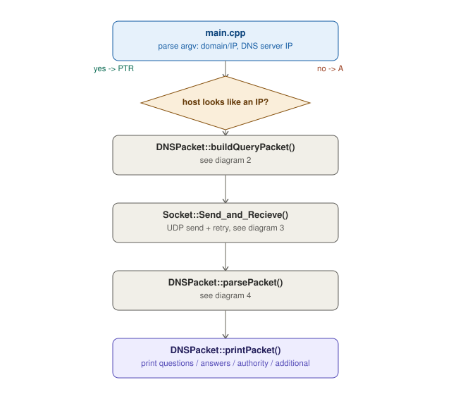
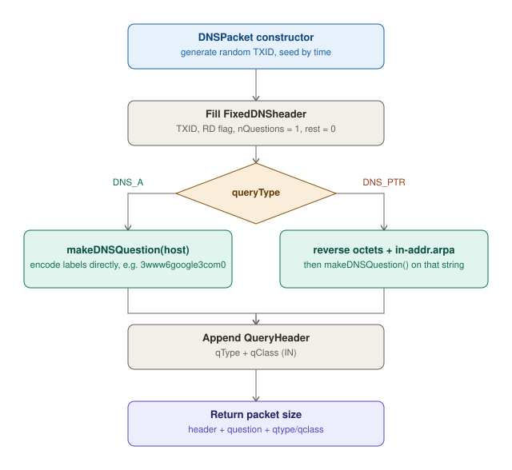
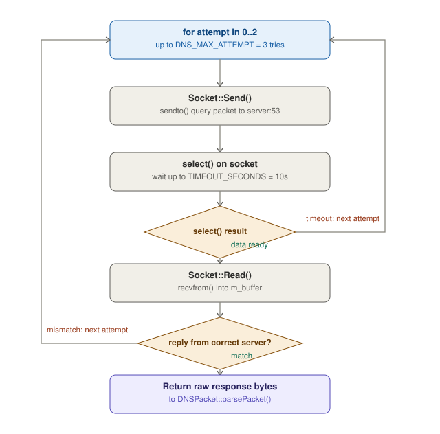
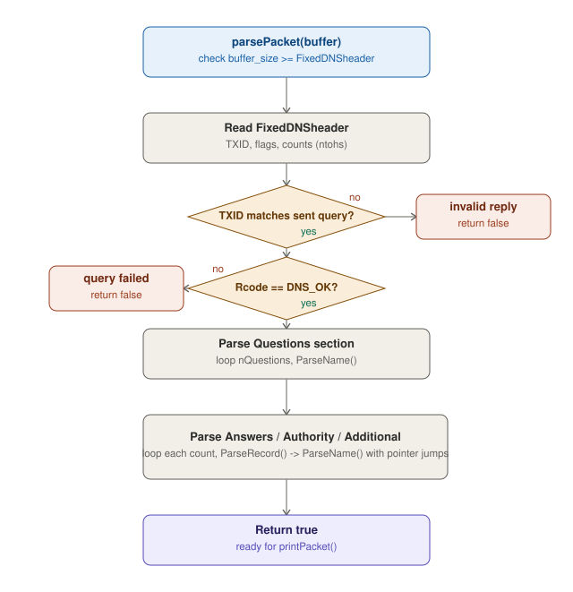
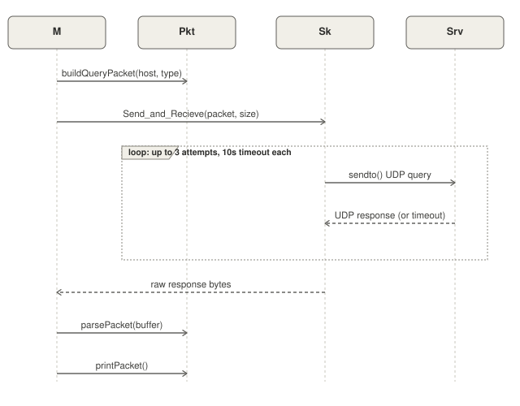

# Custom NSLookup

A Windows-native, from-scratch DNS resolver in C++. Instead of going
through the OS resolver, it builds a raw DNS query packet by hand, sends
it over a UDP socket directly to a specified DNS server (e.g. a school or
public resolver), and hand-parses the wire-format response — including
name compression — to print the answer.

```
Usage: NsLookup.exe <Domain Name | IP> <DNS server IP>
```

- `<Domain Name | IP>` — a hostname for a forward (`A`) lookup, or an IPv4
  address for a reverse (`PTR`) lookup — detected automatically
- `<DNS server IP>` — the resolver to query directly (bypasses the OS's
  configured DNS servers)

> Built on Winsock (`ws2_32`) and raw UDP sockets — this is a Windows-only
> build, not a cross-platform POSIX sockets implementation.

---

## Table of Contents

- [Overview](#overview)
- [Architecture](#architecture)
- [Project Structure](#project-structure)
- [Build](#build)
- [Usage](#usage)
- [Design Notes](#design-notes)
- [Known Issues](#known-issues)
- [Future Work](#future-work)

---

## Overview

<!-- TODO: 2-3 sentence summary — what course/assignment this is for. -->

The program does the full DNS resolution round trip itself, at the wire
protocol level:

1. **Decide query type** — if the input parses as an IPv4 address, it's a
   `PTR` (reverse) lookup; otherwise it's an `A` (forward) lookup.
2. **Build the query packet** — a random transaction ID (`TXID`), the fixed
   DNS header, the encoded question name (reversing octets and appending
   `in-addr.arpa` for PTR queries), and the query type/class.
3. **Send over UDP with retry** — up to 3 attempts, each with a 10-second
   `select()` timeout, discarding replies that don't come from the
   expected server IP/port.
4. **Parse the raw response** — validate the header, reject TXID mismatches
   and non-`OK` Rcodes, then walk the question/answer/authority/additional
   sections, resolving DNS name compression (pointer jumps) along the way.
5. **Print all sections** — questions, answers, authority, and additional
   records, each with type, data, and TTL.

## Architecture

Split into five smaller diagrams instead of one wide canvas, so each stays
readable at normal README width.

### 1. High-level flow

What `main.cpp` drives end to end, treating query construction, the
network round trip, and response parsing as single steps (detailed in
sections 2–4 below).



### 2. Query packet construction

How `DNSPacket::buildQueryPacket()` encodes the question differently for
`A` vs `PTR` lookups before appending the query type and class.



### 3. Send and receive over UDP, with retry

`Socket::Send_and_Recieve()`'s retry loop — timeout handling via
`select()`, and discarding replies from an unexpected source.



### 4. Response parsing pipeline

`DNSPacket::parsePacket()` — header validation, TXID/Rcode checks, then
walking all four resource record sections.



### 5. Full round-trip sequence

The same flow as sections 1–4, shown as a sequence diagram across `main`,
`DNSPacket`, `Socket`, and the remote DNS server — makes the retry loop and
request/response timing explicit.



## Project Structure

```
Custom-NSLookup/
├── CMakeLists.txt
├── include/
│   ├── pch.h              # precompiled header (Winsock, STL, etc.)
│   ├── DNSPacket.h
│   └── Socket.h
└── src/
    ├── main.cpp
    ├── DNSPacket.cpp
    ├── Socket.cpp
    └── pch.cpp
```

| File | Responsibility |
|---|---|
| `main.cpp` | CLI arg parsing, decides `A` vs `PTR` from the input, `WSAStartup`, drives `DNSPacket` + `Socket` end to end |
| `DNSPacket.{h,cpp}` | Builds the raw query packet (header, question encoding, type/class); parses the raw response including name decompression; prints results |
| `Socket.{h,cpp}` | Winsock UDP wrapper — send, `select()`-based timeout, receive, retry-with-attempts logic |

## Build

Windows + Visual Studio (MSVC), via CMake:

```bash
cmake -S . -B build
cmake --build build --config Release
```

`CMakeLists.txt` links `ws2_32` (Winsock) on `WIN32` and precompiles
`include/pch.h`.

> This project depends on Windows-only APIs (Winsock, `sscanf_s`,
> `strtok_s`), so it will not build as-is on Linux/macOS without porting
> the socket layer and swapping the MSVC-specific secure CRT functions.

## Usage

```bash
NsLookup.exe www.example.com 8.8.8.8
```

Reverse lookup (PTR) — pass an IP instead of a hostname:

```bash
NsLookup.exe 93.184.216.34 8.8.8.8
```

<!-- TODO: paste a real sample run here once you have one, e.g.:

Lookup : www.example.com
Query  : www.example.com, type 1, TXID 0x4F2A
Server : 8.8.8.8
********************************
Attempt 0 with 33 bytes... response in 42 ms with 49 bytes
  TXID 0x4F2A, flags 0x8180, questions 1, answers 1, authority 0, additional 0
  succeeded with Rcode = 0
------------ [questions] ----------
	www.example.com type 1 class 1
------------ [answers] ------------
	www.example.com A 93.184.216.34 TTL = 86400
-->

## Design Notes

- **Wire-format packet building**: the DNS header, question section, and
  resource records are built and parsed directly against the RFC 1035 byte
  layout (`#pragma pack(push,1)` structs) rather than using any DNS
  library.
- **TXID as a spoofing/mismatch guard**: each query gets a random 16-bit
  transaction ID; responses with a different TXID, or from a different
  source IP/port than the queried server, are rejected rather than
  trusted.
- **Name decompression is loop-guarded**: `ParseNameHelper` follows DNS
  compression pointers recursively, tracking visited offsets in a `std::set`
  so a malicious or malformed packet with a compression loop throws
  instead of looping forever.
- **Bounds-checked parsing**: every read (`ParseName`, `ParseRecord`, the
  fixed header) checks the cursor against `buffer + buffer_size` before
  dereferencing, and throws/returns `false` on truncated or malformed
  data instead of reading out of bounds.
- **UDP only, no TCP fallback**: large or truncated (`TC` flag) responses
  aren't retried over TCP — this only speaks UDP DNS.

<!-- TODO: confirm whether the TC (truncated) flag is checked/handled
     anywhere, and note it here either way. -->

## Known Issues

- `CMakeLists.txt`'s `target_link_libraries` call links `ws2_32` against a
  target named `WebCrawler`, not `NsLookup` — looks like a copy/paste
  leftover from another project. Worth fixing to `target_link_libraries(NsLookup PRIVATE ws2_32)`
  so the Winsock link isn't silently skipped.
- `CMAKE_CXX_STANDARD_REQUIRE` in `CMakeLists.txt` is missing the trailing
  `D` (`CMAKE_CXX_STANDARD_REQUIRED`), so that setting is currently a no-op.

## Future Work

<!-- TODO -->
- [ ] TCP fallback when the `TC` (truncated) flag is set in the response
- [ ] Cross-platform port (replace Winsock + MSVC secure CRT calls with
      POSIX sockets and standard C library equivalents)
- [ ] Support additional record types beyond A / NS / CNAME / PTR
- [ ] Validate/display the `AA` (authoritative) and `RA` (recursion
      available) flags in the printed output